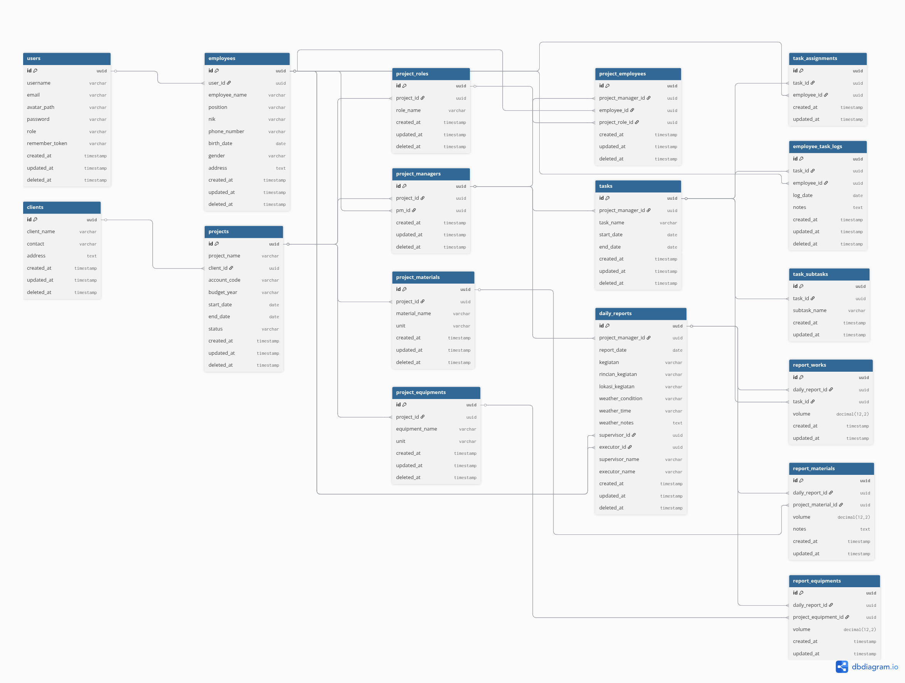

# ProTrack — Project Tracking System

ProTrack adalah aplikasi berbasis **Laravel 10** untuk membantu proses **monitoring proyek konstruksi**: mulai dari data master (client, karyawan), struktur proyek, penugasan tim, hingga pencatatan **daily report** (pekerjaan, material, dan equipment) serta log aktivitas terkait task.

## Fitur Utama

- **Manajemen Client**
  - Data client, kontak, dan alamat.

- **Manajemen Karyawan**
  - Data karyawan (profil, jabatan, NIK, kontak, dll).
  - Akun user terhubung ke karyawan tertentu (1 user : 1 employee).

- **Manajemen Proyek**
  - Proyek terhubung ke client.
  - Multi Project Manager per proyek.
  - Role pekerjaan per proyek.
  - Master material & equipment per proyek.

- **Task & Assignment**
  - Task per Project Manager (per proyek).
  - Subtask per task.
  - Assignment karyawan ke task.

- **Daily Report**
  - Daily report per Project Manager dan tanggal.
  - Mencatat pekerjaan yang dikerjakan (volume), material (volume + catatan), equipment (volume).
  - Menyimpan supervisor/executor (opsional) baik berupa nama maupun referensi ke `employees`.

- **Manajemen Profile**
  - Update username/email/password.
  - Update avatar (disimpan di `storage/app/public/avatars`, path di `users.avatar_path`).

## Role Akses

- **Admin**
  - Mengelola master data (client, employee) dan proyek.

- **PM (Project Manager)**
  - Mengelola daily report dan aktivitas proyek sesuai assignment.

## ERD (Entity Relationship Diagram)

ERD ProTrack menggambarkan alur data inti:

- `clients` memiliki banyak `projects`.
- `projects` memiliki banyak `project_managers` (multi-PM).
- Setiap `project_manager` memiliki tim `project_employees`, daftar `tasks`, dan menghasilkan `daily_reports`.
- `daily_reports` punya detail:
  - `report_works` (pekerjaan per task),
  - `report_materials` (pemakaian material proyek),
  - `report_equipments` (pemakaian equipment proyek).

Gambar ERD:



## Tech Stack

- PHP `^8.1`
- Laravel `^10.x`
- MySQL/MariaDB
- UI berbasis Bootstrap/Metronic bundle (asset statis)
- **Tidak menggunakan NPM sama sekali**

## Instalasi & Menjalankan di Local (tanpa NPM)

### 1) Clone repository
```bash
git clone https://github.com/onicyborg/ProTrack.git
cd ProTrack
```

### 2) Install dependency PHP
```bash
composer install
```

### 3) Setup environment
Copy file env:
```bash
cp .env.example .env
```

Generate APP key:
```bash
php artisan key:generate
```

Atur koneksi database di `.env`:

- `DB_DATABASE`
- `DB_USERNAME`
- `DB_PASSWORD`

Catatan tentang asset UI:

- Project ini **tidak build frontend via NPM**.
- Asset UI mengandalkan file statis (mis. `public/assets`) atau bisa ditarik dari base URL melalui `ASSET_URL`.
- Jika kamu punya server asset terpisah, set `ASSET_URL` ke domain tersebut.
- Jika tidak, pastikan asset template tersedia di `public/assets` dan kosongkan `ASSET_URL`.

### 4) Migrasi + seeding data awal
```bash
php artisan migrate --seed
```

Seeder akan membuat contoh data (admin, beberapa PM, worker employee, sample project hierarchy).

### 5) Buat storage symlink (untuk avatar/profile upload)
```bash
php artisan storage:link
```

### 6) Jalankan aplikasi
```bash
php artisan serve
```

Akses:

- `http://127.0.0.1:8000`

## Akun Default (Seeder)

- Admin
  - Username: `admin`
  - Password: `Qwerty123*`

- PM
  - Username: `pm1` s/d `pm5`
  - Password: `Qwerty123*`

## Catatan Tambahan

- File avatar disimpan di disk `public` dan diakses melalui URL `storage/...`.
- Pastikan permission folder `storage/` dan `bootstrap/cache/` sesuai environment kamu.
